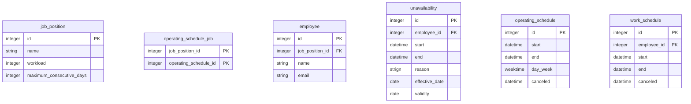

# flexible-work-schedule-organizer

## Database Model 

```mermaid
erDiagram

    job_position {
        integer id PK
        string name
        integer workload
        integer maximum_consecutive_days
    }

    operating_schedule_job {
        integer job_position_id PK
        integer operating_schedule_id PK
    }
    
    employee {
        integer id PK
        integer job_position_id FK
        string name
        string email
    }

    unavailability {
        integer id PK
        integer employee_id FK
        datetime start
        datetime end
        strign reason
        date effective_date
        date validity
    }
    
    operating_schedule {
        integer id PK
        datetime start
        datetime end
        weektime day_week
        datetime canceled
    }

    work_schedule {
        integer id PK
        integer employee_id FK
        datetime start
        datetime end
        datetime canceled
    }

```